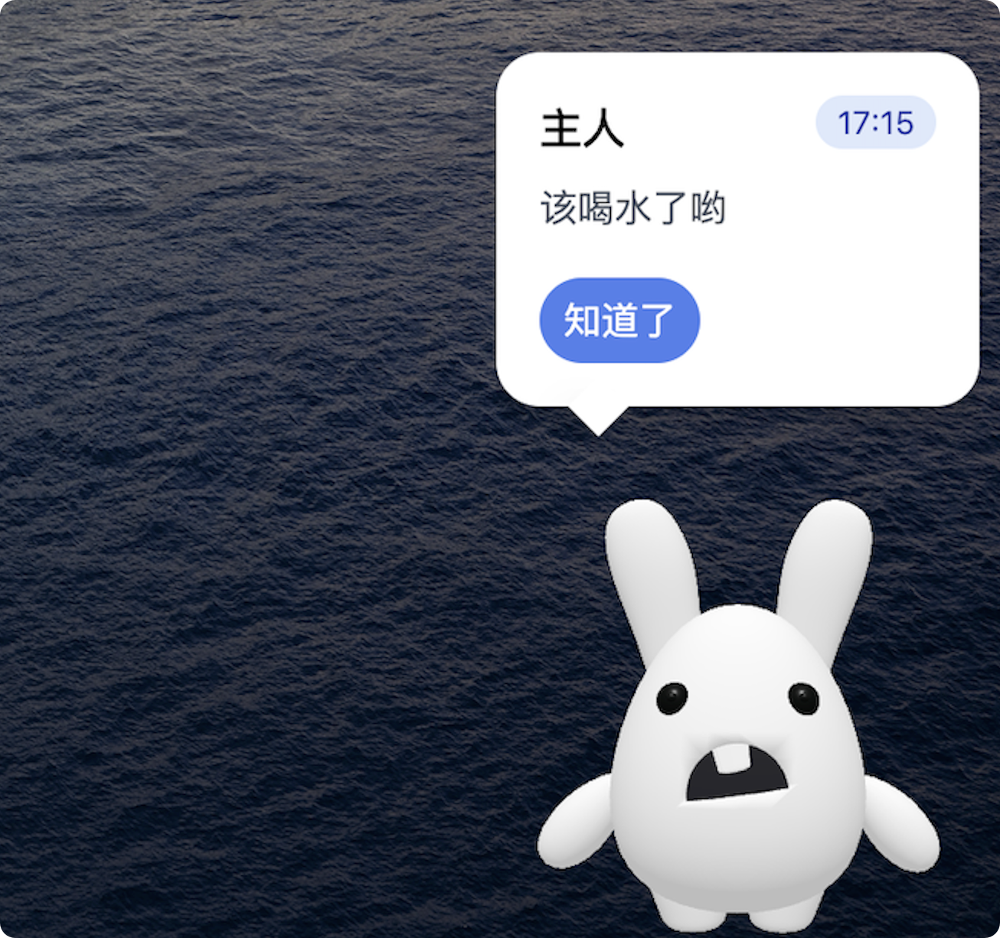

# 小桌宠 (Desktop Pet)

一个基于 Electron + Vue 3 开发的桌面宠物应用,具有任务管理和提醒功能。




## ✨ 功能特性

- 🐰 可爱的 3D 宠物模型
- 📝 任务管理系统
- ⏰ 灵活的提醒功能
- 🎮 宠物互动(运动/休息)
- 🖥️ 跨平台支持(Windows/MacOS/Linux)

## 🚀 技术栈

- Electron
- Vue 3
- TypeScript
- Electron-Vite
- Vite
- TresJS (Three.js for Vue)
- Tailwind CSS
- Dexie.js (IndexedDB)

## 📦 安装

```bash
# 克隆项目
git clone https://github.com/your-username/desktop-pet.git
# 进入项目目录
cd desktop-pet
# 安装依赖
npm install
# 开发模式运行
npm run dev
# 打包应用
npm run build # 所有平台
npm run build:mac-universal # MacOS
npm run build:win # Windows
npm run build:linux # Linux
```

## 🎯 主要功能

### 桌面宠物

- 3D 模型展示
- 拖拽移动
- 互动动画
- 始终置顶显示

### 任务管理

- 创建/编辑/删除任务
- 任务优先级设置
- 任务状态追踪
- 截止时间提醒

### 提醒系统

- 单次提醒
- 自定义间隔重复提醒
- 每日定时提醒
- 弹窗通知

## 📁 项目结构

```bash
src/
├── components/ # 组件
├── views/ # 页面
├── composable/ # 组合式函数
├── db/ # 数据相关
├── router/ # 路由配置
└── assets/ # 静态资源
electron/ # Electron 主进程
```

## 🤝 贡献指南

1. Fork 本仓库
2. 创建特性分支 (`git checkout -b feature/AmazingFeature`)
3. 提交更改 (`git commit -m 'Add some AmazingFeature'`)
4. 推送到分支 (`git push origin feature/AmazingFeature`)
5. 提交 Pull Request

## 📄 开源协议

本项目基于 [MIT](LICENSE) 协议开源。

## 🙏 致谢

- [Vue](https://vuejs.org/)
- [electron-vite](https://electron-vite.github.io/)
- [TresJS](https://tresjs.org/)
- [Electron](https://www.electronjs.org/)
- [Dexie.js](https://dexie.org/)
- [Three.js](https://threejs.org/)
- [Tailwind CSS](https://tailwindcss.com/)
